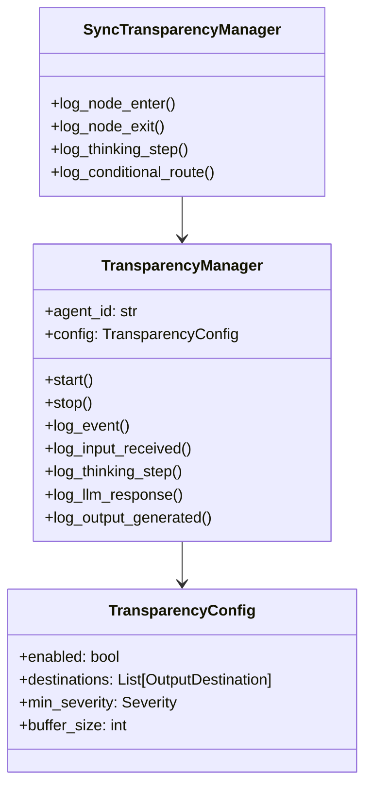

# API Reference

Complete API reference for Agent Transparency.

## Overview

Agent Transparency provides a structured API for logging agent behavior:



## Quick Reference

### Main Classes

| Class | Description |
|-------|-------------|
| [TransparencyManager](/api/transparency-manager) | Main async transparency manager |
| [SyncTransparencyManager](/api/sync-transparency-manager) | Sync wrapper for TransparencyManager |
| [TransparencyConfig](/api/configuration) | Configuration options |
| [TransparencyViewerServer](/api/viewer-server) | Real-time viewer server |

### Enums

| Enum | Description |
|------|-------------|
| [EventType](/api/enums#eventtype) | All event type identifiers |
| [ThinkingPhase](/api/enums#thinkingphase) | Thinking process phases |
| [LangGraphNodeType](/api/enums#langgraphnodetype) | LangGraph node categories |
| [OutputDestination](/api/enums#outputdestination) | Event output targets |
| [Severity](/api/enums#severity) | Event severity levels |

### Data Classes

| Class | Description |
|-------|-------------|
| [EventMetadata](/api/data-classes#eventmetadata) | Common event metadata |
| [InputEvent](/api/data-classes#inputevent) | Input event payload |
| [ThinkingEvent](/api/data-classes#thinkingevent) | Thinking event payload |
| [LangGraphEvent](/api/data-classes#langgraphevent) | LangGraph event payload |
| [LLMEvent](/api/data-classes#llmevent) | LLM event payload |
| [OutputEvent](/api/data-classes#outputevent) | Output event payload |
| [ActionEvent](/api/data-classes#actionevent) | Action event payload |
| [StateSnapshot](/api/data-classes#statesnapshot) | State snapshot payload |
| [ErrorEvent](/api/data-classes#errorevent) | Error event payload |
| [TransparencyEvent](/api/data-classes#transparencyevent) | Complete event envelope |
| [TransparencyContext](/api/data-classes#transparencycontext) | Context for event tracking |

## Factory Function

### create_transparency_manager

```python
def create_transparency_manager(
    agent_id: str,
    kafka_broker: Any = None,
    file_path: str = "./transparency_logs",
    destinations: Optional[List[OutputDestination]] = None,
    enabled: bool = True,
) -> TransparencyManager:
```

Creates a configured TransparencyManager instance.

**Parameters:**

| Parameter | Type | Default | Description |
|-----------|------|---------|-------------|
| `agent_id` | `str` | required | The agent's identifier |
| `kafka_broker` | `Any` | `None` | KafkaBroker instance for Kafka output |
| `file_path` | `str` | `"./transparency_logs"` | Directory for log files |
| `destinations` | `List[OutputDestination]` | `None` | Output destinations (auto-detected if None) |
| `enabled` | `bool` | `True` | Enable or disable transparency |

**Returns:** `TransparencyManager`

**Example:**

```python
from transparency import create_transparency_manager, OutputDestination

# Basic usage
transparency = create_transparency_manager(
    agent_id="my-agent",
    file_path="./logs",
)

# With specific destinations
transparency = create_transparency_manager(
    agent_id="my-agent",
    destinations=[OutputDestination.FILE, OutputDestination.CONSOLE],
    enabled=True,
)
```

## Module Exports

All public API is exported from the main module:

```python
from transparency import (
    # Main classes
    TransparencyManager,
    SyncTransparencyManager,
    create_transparency_manager,

    # Configuration
    TransparencyConfig,
    TransparencyContext,

    # Enums
    EventType,
    ThinkingPhase,
    LangGraphNodeType,
    OutputDestination,
    Severity,

    # Event data classes
    EventMetadata,
    InputEvent,
    ThinkingEvent,
    LangGraphEvent,
    LLMEvent,
    OutputEvent,
    ActionEvent,
    StateSnapshot,
    ErrorEvent,
    TransparencyEvent,

    # Viewer (optional - requires aiohttp)
    TransparencyViewerServer,
    ServerConfig,
    SourceType,
)
```

## Version

```python
from transparency import __version__
print(__version__)  # e.g., "1.0.0"
```

## Type Hints

All classes and functions are fully type-hinted. Use with your type checker:

```python
from transparency import TransparencyManager, ThinkingPhase

async def process(transparency: TransparencyManager) -> None:
    await transparency.log_thinking_step(
        phase=ThinkingPhase.ANALYSIS,
        description="Processing"
    )
```
