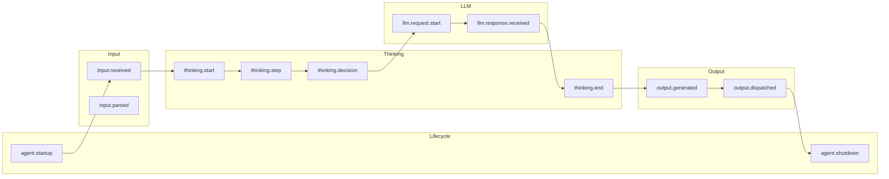

# Event Types

Agent Transparency provides a comprehensive set of event types to capture every aspect of agent behavior.

## Event Categories

Events are organized into logical categories based on their role in the agent lifecycle:



## Lifecycle Events

Track agent startup and shutdown.

| Event Type | Description |
|------------|-------------|
| `AGENT_STARTUP` | Agent has started |
| `AGENT_SHUTDOWN` | Agent is shutting down |
| `AGENT_HEALTH_CHECK` | Health check performed |

```python
# Log agent startup
await transparency.log_agent_startup(metadata={"version": "1.0.0"})

# Log agent shutdown
await transparency.log_agent_shutdown(reason="normal")
```

## Input Events

Capture input reception and processing.

| Event Type | Description |
|------------|-------------|
| `INPUT_RECEIVED` | Raw input received from source |
| `INPUT_VALIDATED` | Input has been validated |
| `INPUT_PARSED` | Input has been parsed and understood |
| `INPUT_REJECTED` | Input was rejected |

```python
# Log received input
await transparency.log_input_received(
    content="What's the weather?",
    source="user",
    content_type="text"
)

# Log parsed input
await transparency.log_input_parsed(
    content="What's the weather?",
    parsed_intent="get_weather",
    entities={"location": None}  # No location specified
)
```

## Thinking Events

Track the agent's reasoning and decision-making process.

| Event Type | Description |
|------------|-------------|
| `THINKING_START` | Beginning of thinking process |
| `THINKING_STEP` | Individual reasoning step |
| `THINKING_DECISION` | A decision has been made |
| `THINKING_END` | Thinking process complete |

### Thinking Phases

Each thinking step has a phase from `ThinkingPhase`:

| Phase | Description |
|-------|-------------|
| `PERCEPTION` | Understanding input |
| `ANALYSIS` | Analyzing the situation |
| `PLANNING` | Formulating a plan |
| `REASONING` | Logical reasoning |
| `EVALUATION` | Evaluating options |
| `DECISION` | Making a decision |
| `SYNTHESIS` | Combining information |
| `REFLECTION` | Self-reflection on process |

```python
from transparency import ThinkingPhase

# Start thinking
await transparency.log_thinking_start("Processing user request")

# Log a thinking step
await transparency.log_thinking_step(
    phase=ThinkingPhase.ANALYSIS,
    description="Analyzing user intent",
    reasoning="User wants weather information but didn't specify location",
    considerations=[
        "Need to determine user's location",
        "Could ask for clarification",
        "Could use default location"
    ],
    confidence=0.8
)

# Log a decision
await transparency.log_thinking_decision(
    decision="Ask user for location",
    rationale="More accurate than guessing",
    alternatives=[
        {"option": "Use IP geolocation", "reason_rejected": "Less accurate"},
        {"option": "Default to NYC", "reason_rejected": "May not be relevant"}
    ],
    confidence=0.9
)

# End thinking
await transparency.log_thinking_end("Decision made")
```

## LangGraph Events

Track LangGraph node executions and state transitions.

| Event Type | Description |
|------------|-------------|
| `GRAPH_INVOKE_START` | Graph execution started |
| `GRAPH_INVOKE_END` | Graph execution completed |
| `GRAPH_NODE_ENTER` | Entering a node |
| `GRAPH_NODE_EXIT` | Exiting a node |
| `GRAPH_EDGE_TRAVERSE` | Traversing an edge |
| `GRAPH_CONDITIONAL_ROUTE` | Conditional routing decision |
| `GRAPH_STATE_UPDATE` | State was updated |

### Node Types

Nodes are categorized by `LangGraphNodeType`:

| Node Type | Description |
|-----------|-------------|
| `MONITOR` | Monitoring/observation node |
| `PLANNER` | Planning node |
| `EXECUTOR` | Execution node |
| `UPDATER` | State update node |
| `ROUTER` | Routing decision node |
| `TOOL_CALLER` | Tool invocation node |
| `RETRIEVER` | Data retrieval node |
| `SUMMARIZER` | Summarization node |
| `VALIDATOR` | Validation node |
| `CUSTOM` | Custom node type |

```python
from transparency import LangGraphNodeType

# Log graph start
await transparency.log_graph_invoke_start(
    initial_state={"messages": [], "plan": None}
)

# Log node enter
await transparency.log_node_enter(
    node_name="planner",
    node_type=LangGraphNodeType.PLANNER,
    state_before=state
)

# Log node exit
await transparency.log_node_exit(
    node_name="planner",
    node_type=LangGraphNodeType.PLANNER,
    state_before=old_state,
    state_after=new_state,
    duration_ms=150
)

# Log conditional routing
await transparency.log_conditional_route(
    from_node="router",
    to_node="executor",
    route_decision="execute_plan",
    state=state
)

# Log graph end
await transparency.log_graph_invoke_end(
    final_state=state,
    duration_ms=2500
)
```

## LLM Events

Track LLM interactions.

| Event Type | Description |
|------------|-------------|
| `LLM_REQUEST_START` | LLM request initiated |
| `LLM_REQUEST_END` | LLM request completed |
| `LLM_PROMPT_SENT` | Prompt sent to LLM |
| `LLM_RESPONSE_RECEIVED` | Response received from LLM |
| `LLM_TOKEN_USAGE` | Token usage information |
| `LLM_ERROR` | LLM error occurred |

```python
# Log LLM request start
await transparency.log_llm_request_start(
    model_name="gpt-4",
    prompt="What is the capital of France?",
    system_prompt="You are a helpful assistant."
)

# Log LLM response
await transparency.log_llm_response(
    model_name="gpt-4",
    prompt="What is the capital of France?",
    response="The capital of France is Paris.",
    input_tokens=25,
    output_tokens=10,
    latency_ms=450
)

# Log LLM error
await transparency.log_llm_error(
    model_name="gpt-4",
    error="Rate limit exceeded",
    prompt="..."
)
```

## Output Events

Track output generation and delivery.

| Event Type | Description |
|------------|-------------|
| `OUTPUT_GENERATED` | Output has been created |
| `OUTPUT_VALIDATED` | Output has been validated |
| `OUTPUT_DISPATCHED` | Output has been sent |
| `OUTPUT_FAILED` | Output delivery failed |

```python
# Log output generation
await transparency.log_output_generated(
    content="The weather in Paris is sunny, 22°C.",
    target="user",
    action_type="response"
)

# Log output dispatch
await transparency.log_output_dispatched(
    content="The weather in Paris is sunny, 22°C.",
    target="user"
)
```

## Action Events

Track planned and executed actions.

| Event Type | Description |
|------------|-------------|
| `ACTION_PLANNED` | Action has been planned |
| `ACTION_DISPATCHED` | Action has been sent |
| `ACTION_COMPLETED` | Action completed successfully |
| `ACTION_FAILED` | Action failed |

```python
# Plan an action
action_id = await transparency.log_action_planned(
    target_agent_id="weather-service",
    instruction="Get current weather for Paris",
    action_type="api_call",
    parameters={"city": "Paris", "units": "metric"}
)

# Log action dispatch
await transparency.log_action_dispatched(
    action_id=action_id,
    target_agent_id="weather-service",
    instruction="Get current weather for Paris"
)

# Log action completion
await transparency.log_action_completed(
    action_id=action_id,
    result="Temperature: 22°C, Condition: Sunny"
)

# Or log action failure
await transparency.log_action_failed(
    action_id=action_id,
    error="API timeout after 30 seconds"
)
```

## State Events

Capture state snapshots and transitions.

| Event Type | Description |
|------------|-------------|
| `STATE_SNAPSHOT` | Full state captured |
| `STATE_TRANSITION` | State changed |

```python
# Log state snapshot
await transparency.log_state_snapshot(
    state={
        "messages": messages,
        "plan": current_plan,
        "squad_status": "executing"
    },
    trigger="after_planning"
)

# Log state transition
await transparency.log_state_transition(
    from_status="planning",
    to_status="executing",
    reason="Plan approved"
)
```

## Error Events

Track errors and recovery.

| Event Type | Description |
|------------|-------------|
| `ERROR_OCCURRED` | Error detected |
| `ERROR_RECOVERED` | Error was recovered |
| `ERROR_FATAL` | Unrecoverable error |

```python
try:
    result = await risky_operation()
except Exception as e:
    await transparency.log_error(
        error_type="APIError",
        message=str(e),
        exception=e,
        context={
            "operation": "weather_fetch",
            "retry_count": 3
        },
        recoverable=True
    )
```

## Debug Events

For development and debugging.

| Event Type | Description |
|------------|-------------|
| `DEBUG_LOG` | Debug message |
| `DEBUG_TRACE` | Detailed trace |

```python
await transparency.log_event(
    EventType.DEBUG_LOG,
    {"message": "Processing step 3", "data": debug_data},
    severity=Severity.DEBUG,
    tags=["debug", "processing"]
)
```

## Next Steps

- [Configuration](/guide/configuration) - Configure event filtering
- [Context Management](/guide/context-management) - Track related events
- [API Reference](/api/event-types) - Complete event type reference
