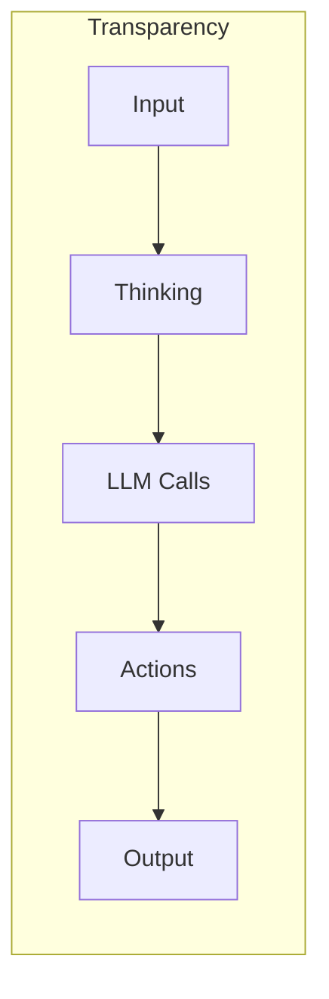
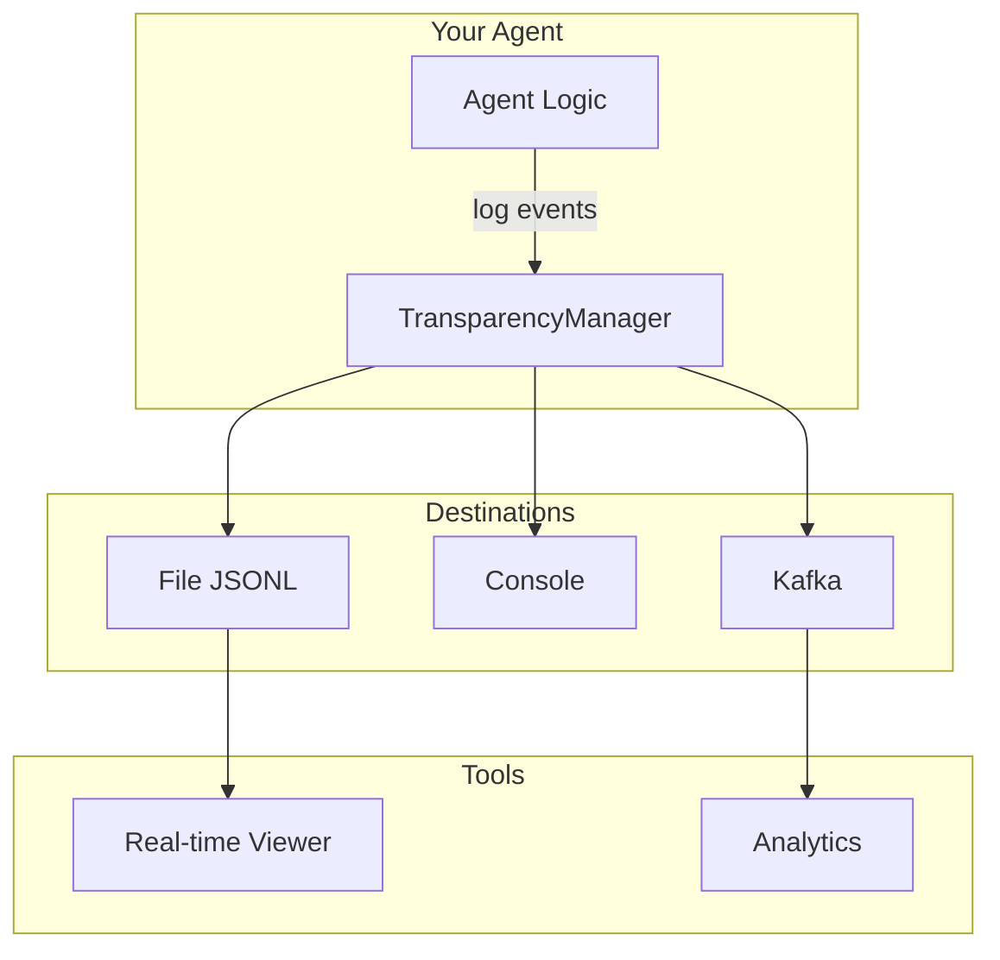

# What is Agent Transparency?

Agent Transparency is a comprehensive Python library designed to provide complete visibility into AI agent behavior. It enables developers to track, log, and visualize every aspect of an agent's operation—from receiving input to generating output, including all the thinking and decision-making steps in between.

## The Problem

As AI agents become more sophisticated and autonomous, understanding their behavior becomes increasingly critical:

- **Debugging is hard**: When an agent produces unexpected results, tracing back through its decision process is often difficult
- **Auditing is essential**: Many applications require complete logs of agent decisions for compliance
- **Optimization is blocked**: Without visibility into what's happening, improving agent performance is guesswork
- **Trust requires transparency**: Users and stakeholders need to understand why agents make certain decisions

## The Solution

Agent Transparency provides a structured, comprehensive logging system that captures:



### Event Categories

| Category | Description | Example Events |
|----------|-------------|----------------|
| **Lifecycle** | Agent startup/shutdown | `agent.startup`, `agent.shutdown` |
| **Input** | Receiving and parsing input | `input.received`, `input.parsed` |
| **Thinking** | Reasoning and decision-making | `thinking.step`, `thinking.decision` |
| **LangGraph** | Graph execution tracking | `graph.node.enter`, `graph.node.exit` |
| **LLM** | Language model interactions | `llm.request.start`, `llm.response.received` |
| **Output** | Generating and sending output | `output.generated`, `output.dispatched` |
| **State** | State snapshots and transitions | `state.snapshot`, `state.transition` |
| **Error** | Error handling and recovery | `error.occurred`, `error.recovered` |

## Key Features

### Multiple Output Destinations

Write transparency events to:

- **Files**: JSONL format for easy parsing and analysis
- **Console**: Color-coded output for development
- **Kafka**: Stream events for real-time processing
- **Webhooks**: Send events to external services

### LangGraph Integration

First-class support for LangGraph applications:

```python
async with transparency.trace_node("planner", LangGraphNodeType.PLANNER, state):
    result = await plan_next_steps()
```

### Context Tracking

Correlate events across sessions and conversations:

```python
async with transparency.context_scope(session_id="user-123"):
    # All events within this scope share the same context
    await transparency.log_input_received("Hello")
```

### Real-time Viewer

Monitor agent activity live in your browser:

```bash
transparency-viewer --log-path ./logs/agent_transparency.jsonl
```

## Use Cases

### Development & Debugging

- Trace execution paths when investigating issues
- Understand why specific decisions were made
- Identify performance bottlenecks

### Production Monitoring

- Monitor agent health and activity
- Stream events to observability platforms
- Set up alerts based on error patterns

### Compliance & Auditing

- Maintain complete audit trails
- Capture all LLM interactions with token counts
- Record decision rationales

### Research & Analysis

- Analyze agent behavior patterns
- Compare different agent configurations
- Build datasets from agent interactions

## Architecture

Agent Transparency is designed to be:

- **Lightweight**: Minimal dependencies for core functionality
- **Non-blocking**: Async-first design with optional sync wrappers
- **Extensible**: Add custom event types and output destinations
- **Type-safe**: Full type hints and dataclass-based structures



## Next Steps

- [Getting Started](/guide/getting-started) - Quick introduction to using the library
- [Installation](/guide/installation) - Detailed installation instructions
- [Event Types](/guide/event-types) - Learn about all available event types
