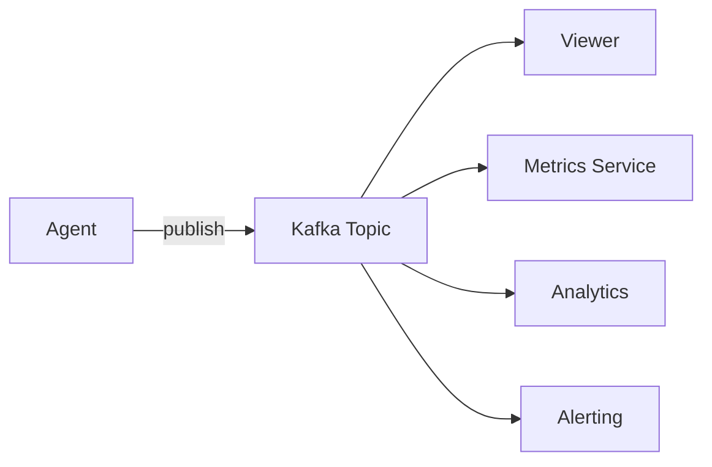

# Kafka Streaming

Stream transparency events to Apache Kafka for real-time processing, analytics, and integration with your observability stack.

## Overview

Kafka streaming enables:
- **Real-time processing**: Process events as they happen
- **Multiple consumers**: Many services can consume the same events
- **Persistence**: Events are stored in Kafka for replay
- **Scalability**: Handle high-volume event streams

## Installation

Install with Kafka support:

```bash
pip install agent-transparency[kafka]
```

This installs `aiokafka>=0.8.0`.

## Configuration

### Basic Kafka Setup

```python
from transparency import (
    TransparencyConfig,
    OutputDestination,
    create_transparency_manager,
)

config = TransparencyConfig(
    destinations=[
        OutputDestination.KAFKA,
        OutputDestination.FILE,  # Keep file backup
    ],
    kafka_topic="agent.my-agent.transparency",
)

transparency = create_transparency_manager(
    agent_id="my-agent",
    config=config,
)
```

### With Kafka Producer

For more control, pass a configured producer:

```python
from aiokafka import AIOKafkaProducer
from transparency import TransparencyConfig, OutputDestination

# Create producer
producer = AIOKafkaProducer(
    bootstrap_servers="localhost:9092",
    value_serializer=lambda v: json.dumps(v).encode('utf-8'),
)
await producer.start()

# Configure transparency
config = TransparencyConfig(
    destinations=[OutputDestination.KAFKA],
    kafka_broker=producer,
    kafka_topic="agent.transparency",
)

transparency = TransparencyManager(agent_id="my-agent", config=config)
```

## Topic Naming

By default, topics are named: `agent.{agent_id}.transparency`

```python
# Default topic for agent "my-agent"
# Topic: agent.my-agent.transparency

# Custom topic
config = TransparencyConfig(
    kafka_topic="custom.events.topic",
)
```

### Topic per Event Type

For separate processing, you can create multiple managers:

```python
# Thinking events
thinking_config = TransparencyConfig(
    kafka_topic="agent.thinking",
    event_type_filter=[
        EventType.THINKING_START,
        EventType.THINKING_STEP,
        EventType.THINKING_DECISION,
        EventType.THINKING_END,
    ],
)

# LLM events
llm_config = TransparencyConfig(
    kafka_topic="agent.llm",
    event_type_filter=[
        EventType.LLM_REQUEST_START,
        EventType.LLM_RESPONSE_RECEIVED,
        EventType.LLM_ERROR,
    ],
)
```

## Event Format

Events are serialized as JSON with this structure:

```json
{
    "event_type": "thinking.step",
    "metadata": {
        "event_id": "550e8400-e29b-41d4-a716-446655440000",
        "timestamp": "2024-01-10T15:30:45.123456Z",
        "agent_id": "my-agent",
        "session_id": "session-123",
        "conversation_id": "conv-456",
        "correlation_id": "abc-def-ghi",
        "sequence_number": 42,
        "severity": "debug",
        "tags": ["thinking", "analysis"]
    },
    "payload": {
        "phase": "analysis",
        "description": "Analyzing user request",
        "reasoning": "User wants weather information",
        "confidence_score": 0.95
    }
}
```

## Consuming Events

### Python Consumer

```python
from aiokafka import AIOKafkaConsumer
import json

async def consume_events():
    consumer = AIOKafkaConsumer(
        "agent.my-agent.transparency",
        bootstrap_servers="localhost:9092",
        group_id="my-consumer-group",
        auto_offset_reset="earliest",
        value_deserializer=lambda m: json.loads(m.decode('utf-8')),
    )
    await consumer.start()

    try:
        async for message in consumer:
            event = message.value
            print(f"Event: {event['event_type']}")

            # Process by type
            if event["event_type"].startswith("error."):
                await handle_error(event)
            elif event["event_type"].startswith("llm."):
                await track_llm_usage(event)
    finally:
        await consumer.stop()
```

### With the Viewer

The transparency viewer can consume from Kafka:

```bash
transparency-viewer \
    --kafka-bootstrap localhost:9092 \
    --kafka-topic agent.my-agent.transparency
```

### Multiple Consumers

Multiple services can consume the same topic:



## Integration Examples

### With Prometheus Metrics

```python
from prometheus_client import Counter, Histogram
from aiokafka import AIOKafkaConsumer

# Define metrics
events_total = Counter(
    'agent_events_total',
    'Total events by type',
    ['event_type', 'agent_id']
)
llm_latency = Histogram(
    'agent_llm_latency_seconds',
    'LLM request latency',
    ['model']
)

async def metrics_consumer():
    consumer = AIOKafkaConsumer(
        "agent.transparency",
        bootstrap_servers="localhost:9092",
        group_id="metrics-consumer",
    )
    await consumer.start()

    async for message in consumer:
        event = json.loads(message.value)

        # Count all events
        events_total.labels(
            event_type=event["event_type"],
            agent_id=event["metadata"]["agent_id"]
        ).inc()

        # Track LLM latency
        if event["event_type"] == "llm.response.received":
            latency = event["payload"].get("latency_ms", 0) / 1000
            model = event["payload"]["model_name"]
            llm_latency.labels(model=model).observe(latency)
```

### With Elasticsearch

```python
from elasticsearch import AsyncElasticsearch

async def elasticsearch_consumer():
    es = AsyncElasticsearch(["http://localhost:9200"])
    consumer = AIOKafkaConsumer(
        "agent.transparency",
        bootstrap_servers="localhost:9092",
        group_id="elasticsearch-consumer",
    )
    await consumer.start()

    async for message in consumer:
        event = json.loads(message.value)

        # Index to Elasticsearch
        await es.index(
            index=f"agent-transparency-{event['metadata']['agent_id']}",
            id=event["metadata"]["event_id"],
            document=event,
        )
```

### With Apache Flink

```java
// Java Flink consumer
DataStream<String> kafkaStream = env
    .addSource(new FlinkKafkaConsumer<>(
        "agent.transparency",
        new SimpleStringSchema(),
        properties
    ));

// Parse and process events
DataStream<AgentEvent> events = kafkaStream
    .map(json -> objectMapper.readValue(json, AgentEvent.class))
    .filter(event -> event.getType().startsWith("error."))
    .keyBy(event -> event.getMetadata().getAgentId());
```

## Error Handling

### Producer Errors

Handle Kafka connection issues:

```python
from aiokafka.errors import KafkaError

try:
    await transparency.log_event(...)
except KafkaError as e:
    # Fall back to file logging
    print(f"Kafka error: {e}, falling back to file")
```

### Consumer Recovery

Handle consumer failures:

```python
async def resilient_consumer():
    while True:
        try:
            await consume_events()
        except Exception as e:
            print(f"Consumer error: {e}, restarting...")
            await asyncio.sleep(5)
```

## Performance Tuning

### Batching

Configure batching for higher throughput:

```python
producer = AIOKafkaProducer(
    bootstrap_servers="localhost:9092",
    linger_ms=100,  # Wait up to 100ms to batch
    batch_size=16384,  # 16KB batch size
)
```

### Partitioning

Use agent_id for partitioning to maintain ordering:

```python
# Events from same agent go to same partition
producer = AIOKafkaProducer(
    bootstrap_servers="localhost:9092",
    key_serializer=lambda k: k.encode('utf-8'),
)

# Publish with key
await producer.send(
    topic,
    key=agent_id,
    value=event_json.encode(),
)
```

### Compression

Enable compression for lower bandwidth:

```python
producer = AIOKafkaProducer(
    bootstrap_servers="localhost:9092",
    compression_type="gzip",  # or "snappy", "lz4"
)
```

## Docker Compose Example

```yaml
version: '3.8'
services:
  zookeeper:
    image: confluentinc/cp-zookeeper:latest
    environment:
      ZOOKEEPER_CLIENT_PORT: 2181

  kafka:
    image: confluentinc/cp-kafka:latest
    depends_on:
      - zookeeper
    ports:
      - "9092:9092"
    environment:
      KAFKA_BROKER_ID: 1
      KAFKA_ZOOKEEPER_CONNECT: zookeeper:2181
      KAFKA_ADVERTISED_LISTENERS: PLAINTEXT://localhost:9092
      KAFKA_OFFSETS_TOPIC_REPLICATION_FACTOR: 1

  agent:
    build: .
    depends_on:
      - kafka
    environment:
      KAFKA_BOOTSTRAP_SERVERS: kafka:9092

  viewer:
    image: python:3.12
    command: >
      sh -c "pip install agent-transparency[all] &&
             transparency-viewer --kafka-bootstrap kafka:9092 --kafka-topic agent.transparency"
    ports:
      - "8765:8765"
    depends_on:
      - kafka
```

## Best Practices

1. **Use meaningful topic names** that include agent ID
2. **Set up dead letter queues** for failed events
3. **Monitor consumer lag** to detect processing delays
4. **Configure retention** based on your needs
5. **Use compression** for high-volume streams
6. **Partition by agent_id** for ordering guarantees

## Next Steps

- [Real-time Viewer](/guide/viewer) - Monitor Kafka events
- [Configuration](/guide/configuration) - Full Kafka configuration
- [Examples](/examples/) - Production Kafka patterns
