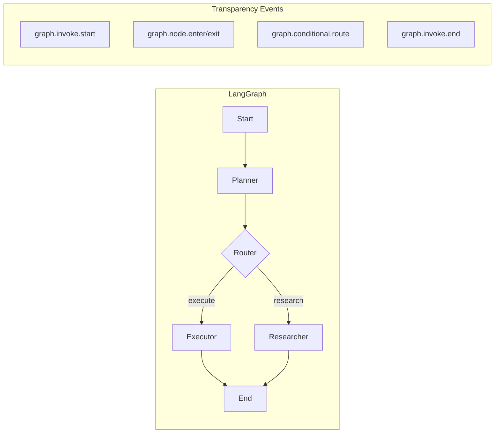

# LangGraph Integration

Agent Transparency provides first-class support for LangGraph, enabling you to track node executions, state transitions, and routing decisions.

## Overview

When building agents with LangGraph, you typically have:
- **Nodes**: Functions that process state
- **Edges**: Connections between nodes
- **Conditional routing**: Dynamic path decisions
- **State**: Data flowing through the graph

Agent Transparency captures all of these aspects.



## Basic Integration

### Tracking Node Execution

Use `trace_node` context manager for automatic entry/exit tracking:

```python
from transparency import TransparencyManager, LangGraphNodeType

transparency = TransparencyManager(agent_id="my-graph-agent")

async def planner_node(state):
    """Planning node with transparency."""
    async with transparency.trace_node(
        node_name="planner",
        node_type=LangGraphNodeType.PLANNER,
        state=state,
    ):
        # Your planning logic here
        plan = await create_plan(state["messages"])
        return {"plan": plan}
```

### Manual Node Tracking

For more control, use separate enter/exit calls:

```python
async def executor_node(state):
    """Executor node with manual tracking."""
    state_before = dict(state)

    await transparency.log_node_enter(
        node_name="executor",
        node_type=LangGraphNodeType.EXECUTOR,
        state_before=state_before,
    )

    start_time = time.time()
    try:
        # Execute the plan
        result = await execute_plan(state["plan"])
        new_state = {**state, "result": result}
    finally:
        duration_ms = int((time.time() - start_time) * 1000)
        await transparency.log_node_exit(
            node_name="executor",
            node_type=LangGraphNodeType.EXECUTOR,
            state_before=state_before,
            state_after=new_state,
            duration_ms=duration_ms,
        )

    return new_state
```

## Tracking Graph Execution

### Invoke Start and End

Track the full graph execution lifecycle:

```python
from langgraph.graph import StateGraph

async def run_graph(user_input: str):
    # Log graph start
    initial_state = {"messages": [user_input], "plan": None}
    await transparency.log_graph_invoke_start(initial_state=initial_state)

    start_time = time.time()
    try:
        # Run the graph
        final_state = await graph.ainvoke(initial_state)
    finally:
        duration_ms = int((time.time() - start_time) * 1000)
        await transparency.log_graph_invoke_end(
            final_state=final_state,
            duration_ms=duration_ms,
        )

    return final_state
```

### Conditional Routing

Track routing decisions:

```python
def route_decision(state):
    """Router that logs its decision."""
    # Determine the route
    if state.get("needs_research"):
        next_node = "researcher"
        decision = "needs_research"
    elif state.get("plan"):
        next_node = "executor"
        decision = "has_plan"
    else:
        next_node = "planner"
        decision = "needs_planning"

    # Log the routing decision (sync version for LangGraph)
    sync_transparency.log_conditional_route(
        from_node="router",
        to_node=next_node,
        route_decision=decision,
        state=state,
    )

    return next_node
```

## Node Types

Use appropriate node types for better categorization:

| Node Type | Use Case |
|-----------|----------|
| `MONITOR` | Observing/checking state |
| `PLANNER` | Creating plans |
| `EXECUTOR` | Executing actions |
| `UPDATER` | Updating state |
| `ROUTER` | Making routing decisions |
| `TOOL_CALLER` | Calling external tools |
| `RETRIEVER` | Fetching data |
| `SUMMARIZER` | Summarizing information |
| `VALIDATOR` | Validating state/output |
| `CUSTOM` | Custom node types |

```python
from transparency import LangGraphNodeType

# Examples
async with transparency.trace_node("monitor", LangGraphNodeType.MONITOR, state):
    await check_system_health()

async with transparency.trace_node("retriever", LangGraphNodeType.RETRIEVER, state):
    docs = await retrieve_documents(query)

async with transparency.trace_node("summarizer", LangGraphNodeType.SUMMARIZER, state):
    summary = await summarize(docs)
```

## Synchronous Usage with SyncTransparencyManager

LangGraph nodes are often synchronous. Use `SyncTransparencyManager` for these cases:

```python
from transparency import TransparencyManager, SyncTransparencyManager

# Create async manager first
async_manager = TransparencyManager(agent_id="my-agent")

# Create sync wrapper
sync_transparency = SyncTransparencyManager(async_manager)

def my_sync_node(state):
    """Synchronous LangGraph node."""
    # Use sync methods
    sync_transparency.log_node_enter(
        "my_node",
        LangGraphNodeType.CUSTOM,
        state
    )

    # Do work...
    new_state = process(state)

    sync_transparency.log_node_exit(
        "my_node",
        LangGraphNodeType.CUSTOM,
        state,
        new_state
    )

    return new_state
```

## Complete Example

Here's a complete example of a LangGraph agent with full transparency:

```python
import asyncio
from langgraph.graph import StateGraph, END
from typing import TypedDict, List, Optional

from transparency import (
    TransparencyManager,
    SyncTransparencyManager,
    LangGraphNodeType,
    ThinkingPhase,
    create_transparency_manager,
)

# Define state
class AgentState(TypedDict):
    messages: List[str]
    plan: Optional[List[str]]
    result: Optional[str]

# Create transparency manager
transparency = create_transparency_manager(
    agent_id="langgraph-agent",
    file_path="./logs",
)
sync_transparency = SyncTransparencyManager(transparency)

def planner_node(state: AgentState) -> AgentState:
    """Plan the next steps."""
    sync_transparency.log_node_enter(
        "planner",
        LangGraphNodeType.PLANNER,
        dict(state)
    )

    sync_transparency.log_thinking_step(
        ThinkingPhase.PLANNING,
        "Creating action plan",
        reasoning="Analyzing user request to determine steps"
    )

    # Create a plan
    plan = ["Step 1: Analyze", "Step 2: Execute", "Step 3: Respond"]

    new_state = {**state, "plan": plan}

    sync_transparency.log_node_exit(
        "planner",
        LangGraphNodeType.PLANNER,
        dict(state),
        new_state
    )

    return new_state

def executor_node(state: AgentState) -> AgentState:
    """Execute the plan."""
    sync_transparency.log_node_enter(
        "executor",
        LangGraphNodeType.EXECUTOR,
        dict(state)
    )

    # Execute plan steps
    result = f"Executed {len(state['plan'])} steps successfully"

    new_state = {**state, "result": result}

    sync_transparency.log_node_exit(
        "executor",
        LangGraphNodeType.EXECUTOR,
        dict(state),
        new_state
    )

    return new_state

def router(state: AgentState) -> str:
    """Decide next node."""
    if state.get("plan") is None:
        next_node = "planner"
    elif state.get("result") is None:
        next_node = "executor"
    else:
        next_node = END

    sync_transparency.log_conditional_route(
        from_node="router",
        to_node=next_node,
        route_decision=f"has_plan={state.get('plan') is not None}, has_result={state.get('result') is not None}",
        state=dict(state)
    )

    return next_node

# Build graph
def build_graph():
    graph = StateGraph(AgentState)

    graph.add_node("planner", planner_node)
    graph.add_node("executor", executor_node)

    graph.set_entry_point("planner")

    graph.add_conditional_edges(
        "planner",
        router,
        {"executor": "executor", END: END}
    )

    graph.add_conditional_edges(
        "executor",
        router,
        {END: END}
    )

    return graph.compile()

async def main():
    # Start transparency
    await transparency.start()

    try:
        # Build and run graph
        graph = build_graph()

        initial_state: AgentState = {
            "messages": ["What is the weather?"],
            "plan": None,
            "result": None,
        }

        # Log graph invoke
        await transparency.log_graph_invoke_start(initial_state)

        # Run the graph
        final_state = await graph.ainvoke(initial_state)

        await transparency.log_graph_invoke_end(final_state)

        print(f"Result: {final_state['result']}")

    finally:
        await transparency.stop()

if __name__ == "__main__":
    asyncio.run(main())
```

## State Delta Tracking

Agent Transparency automatically computes state deltas:

```python
# When you log node exit with before/after states
await transparency.log_node_exit(
    "my_node",
    LangGraphNodeType.CUSTOM,
    state_before={"count": 1, "items": ["a"]},
    state_after={"count": 2, "items": ["a", "b"]},
)

# The logged event includes computed delta:
# {
#     "state_delta": {
#         "count": {"before": 1, "after": 2},
#         "items": {"before": ["a"], "after": ["a", "b"]}
#     }
# }
```

## Best Practices

1. **Use appropriate node types** for better categorization and filtering
2. **Track all nodes** to get complete execution visibility
3. **Log routing decisions** to understand path choices
4. **Capture state before and after** for delta tracking
5. **Include duration** for performance analysis
6. **Use sync wrapper** for synchronous LangGraph nodes

## Next Steps

- [LLM Tracking](/guide/llm-tracking) - Track LLM calls within nodes
- [Synchronous Usage](/guide/sync-usage) - More on sync integration
- [Examples](/examples/langgraph) - More LangGraph examples
